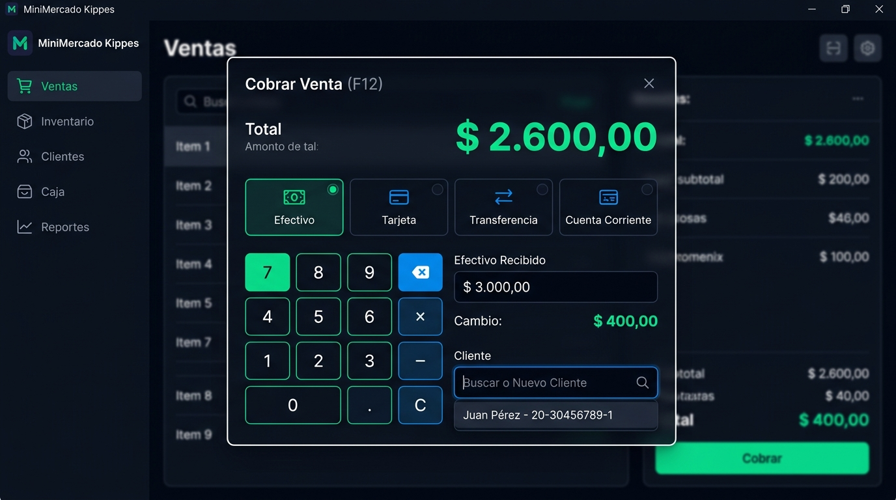
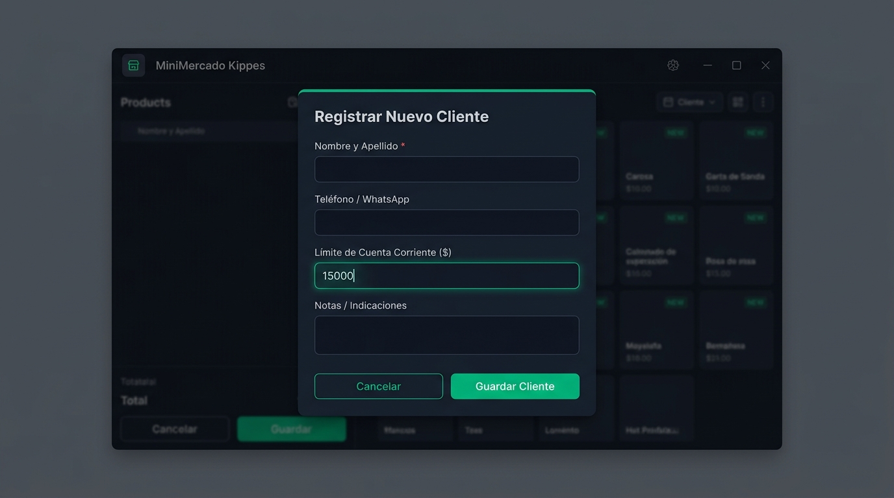
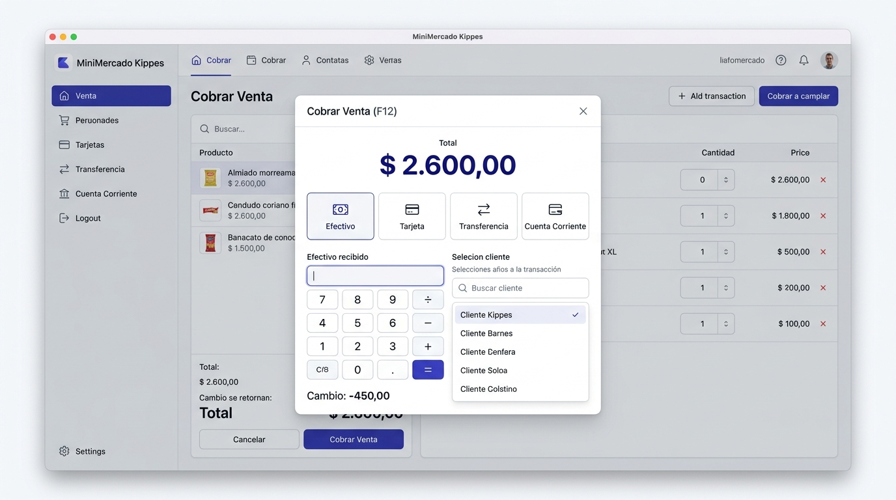
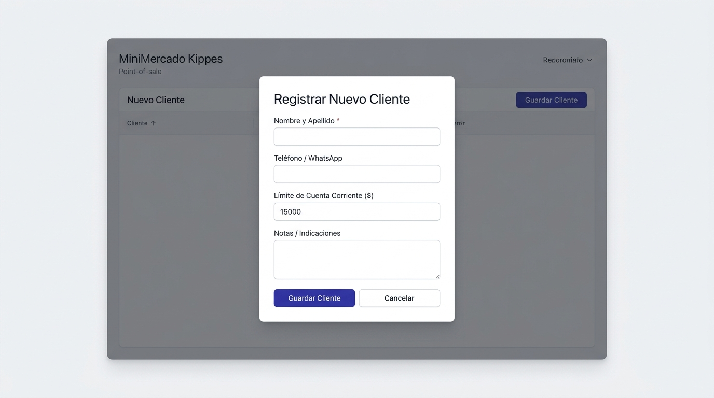
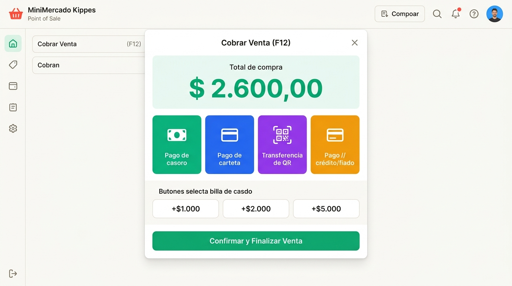
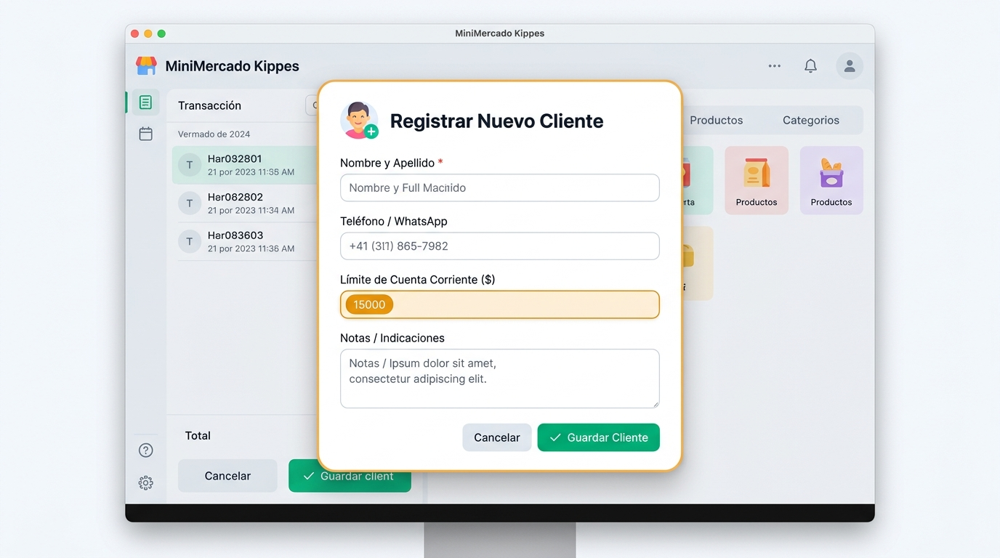
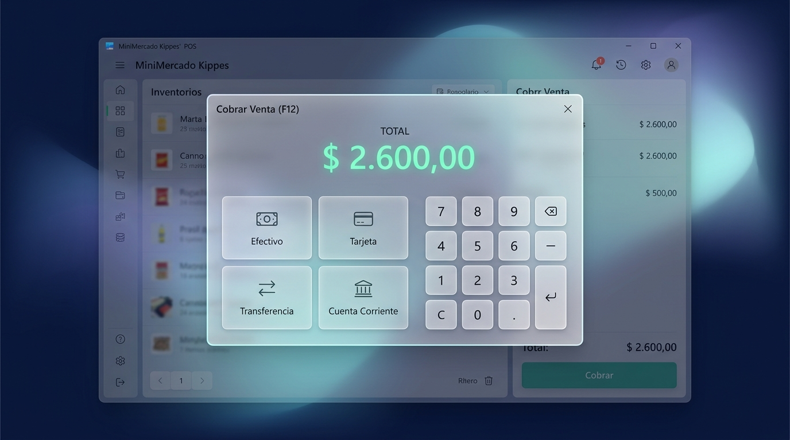
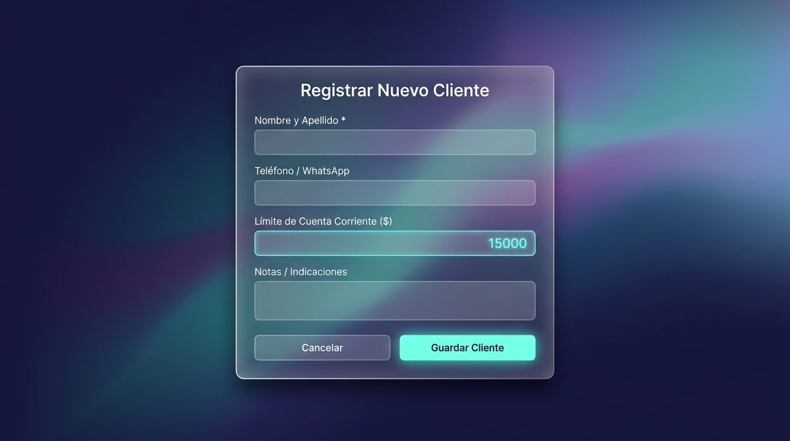
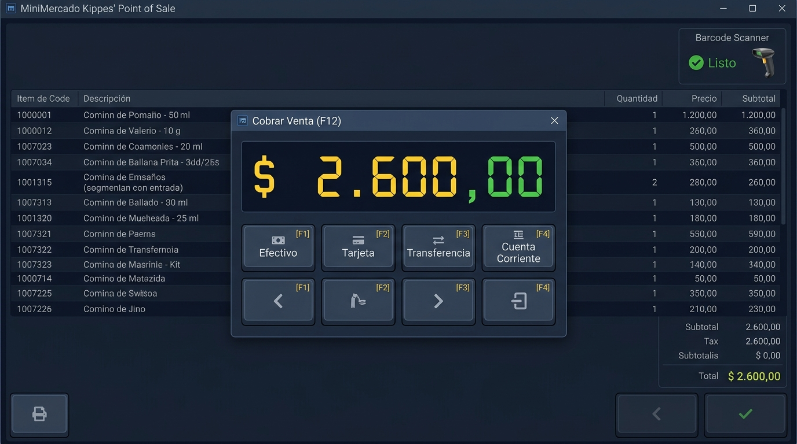
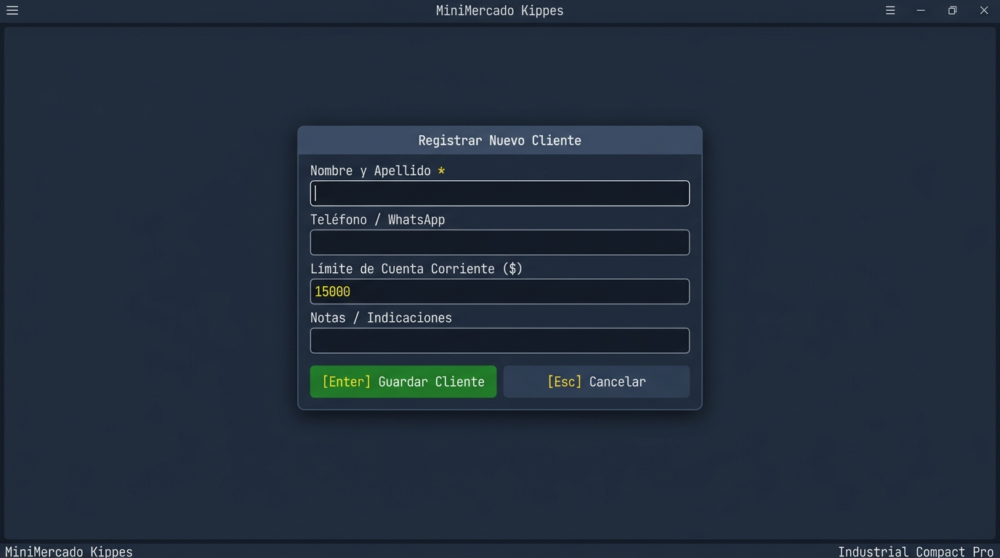

# Catálogo de Propuestas de Diseño UI — MiniMercado Kippes

Este catálogo presenta **5 propuestas de diseño visual completas e independientes** para el sistema POS **MiniMercado Kippes**. Cada diseño cuenta con su propia dirección estética, paleta de colores, tipografía y mockups de alta fidelidad mostrando cómo se vería la interfaz y sus modales clave (Cobro F12 y Alta de Cliente).

> ⚠️ **Nota:** Ninguno de estos diseños ha sido aplicado al código fuente del sistema. El diseño actual permanece intacto hasta que elijas cuál prefieres implementar o si deseas mantener el actual.

---

## 🎨 Comparativa de las 5 Propuestas

| # | Nombre del Diseño | Estilo / Filosofía | Paleta Principal | Ideal para... |
| :---: | :--- | :--- | :--- | :--- |
| **1** | [**Obsidian Dark & Neon Emerald**](./diseño-1-modern-dark/README.md) | Dark Mode moderno de alto contraste con resplandores esmeralda | `#0b0f19`, `#131926`, `#10b981`, `#2563eb` | Kioscos nocturnos, reducción de fatiga visual, look cyber-clean. |
| **2** | [**Nordic Minimal & Deep Indigo**](./diseño-2-nordic-clean/README.md) | Minimalismo suizo/escandinavo ultra limpio (estilo Stripe/Apple) | `#f8fafc`, `#ffffff`, `#4f46e5`, `#e2e8f0` | Máxima serenidad, elegancia profesional y claridad visual diurna. |
| **3** | [**Vibrant Retail & Kiosk Express**](./diseño-3-vibrant-retail/README.md) | Enérgico, botones táctiles color-coded para cobro ultrarrápido | `#f9fafb`, `#10b981`, `#2563eb`, `#9333ea`, `#f59e0b` | Atención rápida al público, capacitación inmediata de nuevos cajeros. |
| **4** | [**Aurora Glassmorphism**](./diseño-4-glassmorphism/README.md) | Acrílico translúcido (*backdrop blur*), estilo macOS Sonoma / iOS 18 | Fondo aurora `#0a0e1a`/`#1e1b4b`, vidrio `rgba(255,255,255,0.08)`, `#22d3ee` | Pantallas táctiles modernas, imagen futurista y exclusiva de alta gama. |
| **5** | [**Industrial Compact Pro**](./diseño-5-industrial-compact/README.md) | Terminal industrial de alta densidad, badges de atajos de teclado `[F1-F12]` | `#0f172a`, `#1e293b`, `#facc15` (ámbar digital), `#4ade80` | Velocidad récord de tipeo por teclado, farmacias y puntos de venta masivos. |

---

## 📸 Galería Visual Rápida

### 1. [Diseño 1: Obsidian Dark & Neon Emerald](./diseño-1-modern-dark/README.md)

---

### 2. [Diseño 2: Nordic Minimal & Deep Indigo](./diseño-2-nordic-clean/README.md)

---

### 3. [Diseño 3: Vibrant Retail & Kiosk Express](./diseño-3-vibrant-retail/README.md)

---

### 4. [Diseño 4: Aurora Glassmorphism](./diseño-4-glassmorphism/README.md)

---

### 5. [Diseño 5: Industrial Compact Pro](./diseño-5-industrial-compact/README.md)

---

## ¿Cómo proceder?
Revisa las carpetas y los mockups a pantalla completa. Cuando decidas:
- Podemos aplicar cualquiera de estos estilos visuales a todo el sistema (o combinar elementos de tus preferidos).
- O si prefieres, conservar el diseño actual tal como está.
